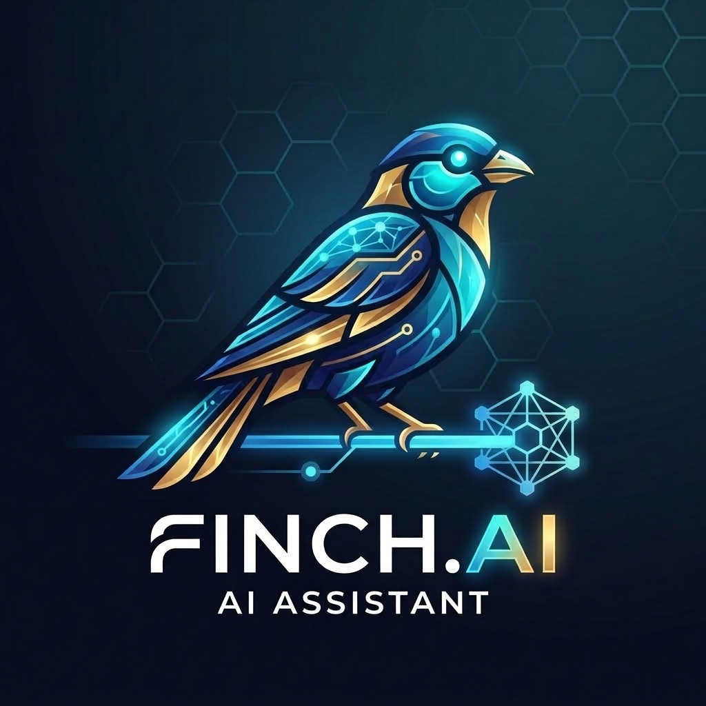
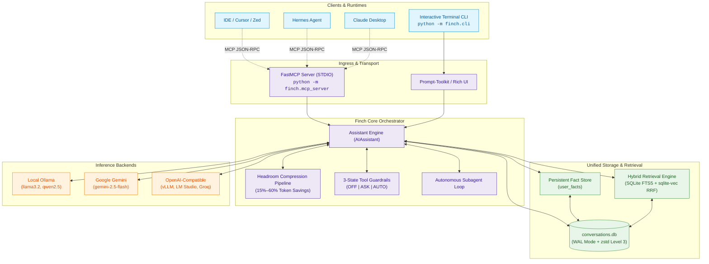

<div align="center">

# Finch.ai



<p>
<strong>A High-Performance Agentic Workspace Engine & Model Context Protocol (MCP) Server</strong><br/>
Featuring Headroom context compression, hybrid vector-lexical memory, and granular tool guardrails across local & cloud LLMs.
</p>

[](https://python.org)
[](https://modelcontextprotocol.io)
[](https://github.com/jlowin/fastmcp)
[](https://github.com/asg017/sqlite-vec)
[](#key-innovations)
[](docs/main.pdf)

</div>

---

## Architecture Overview

Finch operates concurrently as a **local interactive CLI chat & agent harness** and as a **standardized Model Context Protocol (MCP) server** exposing autonomous subagent delegation, persistent memory, and context compression to external runtime environments.



---

## Key Innovations

> ⚡ **Headroom Context Compression (15%–60% Savings)**  
> Intelligently prunes and compresses verbose tool outputs, terminal logs, code blocks, and intermediate conversational turns using dynamic token headroom budgets while strictly preserving persona rules, system prompts, and the most recent active turns.

> 🔍 **Hybrid Vector-Lexical Search (FTS5 + `sqlite-vec` RRF)**  
> Combines exact keyword matching via SQLite FTS5 (BM25) with dense 768-dimensional semantic embeddings via `sqlite-vec` using **Reciprocal Rank Fusion (RRF)**. Enables precision recall of past project context, code snippets, and conversational memories.

> 📦 **High-Density `zstd` Storage Engine**  
> Every archived message turn and agent transcript is transparently compressed using **Level-3 Zstandard (`zstd`)** before commit to SQLite. Combined with Write-Ahead Logging (WAL) and automated checkpoints, this keeps long-term disk footprints tiny with sub-millisecond retrieval.

---

## Quick Start

### 1. Installation & Environment Setup

```bash
# Clone repository and enter directory
git clone https://github.com/your-username/Ai_Assistant.git
cd Ai_Assistant

# Create and activate virtual environment
python3 -m venv .venv
source .venv/bin/activate

# Install dependencies
pip install -r requirements.txt

# Configure environment keys (Ollama works locally out-of-the-box)
cp .env.example .env
```

---

### Option A: Interactive CLI Chat

Launch Finch directly in your terminal with rich streaming output, markdown rendering, and slash command autocompletion:

```bash
# Start interactive CLI session (default Ollama model)
python -m finch.cli

# Launch with Google Gemini or OpenAI-compatible backends
python -m finch.cli --provider gemini --model gemini-2.5-flash
python -m finch.cli --provider openai --model gpt-4o-mini

# Start directly in Autonomous Agent Mode
python -m finch.cli --mode agent

# Run a non-interactive single query
python -m finch.cli -q "Analyze the current workspace architecture."
```

*(Note: `python main.py` remains available as an alias.)*

---

### Option B: Run as MCP Server

Run Finch as a headless **Model Context Protocol (MCP)** service to provide persistent memory, hybrid search, context compression, and subagent execution to external tools:

```bash
# Launch Finch FastMCP server over STDIO
python -m finch.mcp_server
```

#### Claude Desktop Integration
Add the following to your `claude_desktop_config.json`:

```json
{
  "mcpServers": {
    "finch": {
      "command": "/absolute/path/to/Ai_Assistant/.venv/bin/python",
      "args": ["-m", "finch.mcp_server"],
      "cwd": "/absolute/path/to/Ai_Assistant"
    }
  }
}
```

#### Hermes Agent Integration
Export verified persona instructions and persistent facts directly into Hermes Agent's native directories:

```bash
# Preview or migrate persona & facts to ~/.hermes/
python -m finch.tools.export_hermes --dry-run
python -m finch.tools.export_hermes
```

---

## Command Cheat Sheet

Inside an active CLI session, use slash commands to inspect state, adjust guardrails, and execute administrative tasks:

<details open>
<summary><strong>Interactive Slash Commands Reference</strong> (Click to collapse)</summary>

| Command | Syntax / Options | Description |
| :--- | :--- | :--- |
| **`/remember`** | `/remember <fact>` | Store verified facts and user preferences directly into persistent memory. |
| **`/facts`** | `/facts [category]` | List all stored user facts and knowledge categorized by domain. |
| **`/hybrid`** | `/hybrid <query>` | Execute semantic + lexical (FTS5 + `sqlite-vec` RRF) search across history. |
| **`/search`** | `/search <query>` | Fast BM25 exact lexical search across past conversation turns. |
| **`/storage`** | `/storage` | Inspect SQLite database footprint, message counts, and `zstd` compression stats. |
| **`/vacuum`** | `/vacuum` | Perform database maintenance, WAL checkpointing, and page defragmentation. |
| **`/tools`** | `/tools [cat] [off\|ask\|auto]` | Inspect or update guardrails for `terminal`, `python`, `web`, or `files`. |
| **`/mode`** | `/mode [chat\|agent]` | Switch between single-turn Chat mode and autonomous multi-turn Agent mode. |
| **`/persona`** | `/persona [reload\|adapt\|edit]` | Inspect, evolve, or reload system prompt rules from `personality.md`. |
| **`/compress`** | `/compress [on\|off\|stats]` | Toggle Headroom context compression and view token reduction percentages. |
| **`/provider`** | `/provider [gemini\|ollama] [key]` | Inspect current provider, dynamically switch runtime, or configure API key. |
| **`/providers`** | `/providers` | Table of all configured inference providers, endpoints, and health status. |
| **`/models`** | `/models [provider\|all]` / `/use <model>` | View models for current, specific, or all providers, or switch active model. |
| **`/export`** | `/export <md\|html\|bundle>` | Export session as GitHub-flavored Markdown, styled HTML, or backup zip. |
| **`/help`** | `/help` | Print the full interactive command reference manual. |

</details>

---

## Exposed MCP Tools Reference

When connected via MCP, Finch exposes the following tools to Claude Desktop, Hermes Agent, and IDE agents:

| Tool | Parameters | Description |
| :--- | :--- | :--- |
| **`finch_run_subagent`** | `instruction: str`, `max_turns: int = 8` | Headless multi-turn agent execution delegating filesystem, Python REPL, or shell tasks with Headroom compression and DB logging. *(Alias: `run_subagent`)* |
| **`finch_remember_fact`** | `fact: str`, `category: str = "general"` | Insert verified facts directly into Finch long-term persistent memory. |
| **`finch_get_user_facts`** | `category: str = None` | Fetch verified user preferences and project facts from `user_facts` table. |
| **`finch_search_history`** | `query: str`, `limit: int = 5` | Hybrid FTS5 + `sqlite-vec` RRF search across archived conversations. |
| **`finch_get_transcript`** | `session_id: str` | Retrieve and decompress zstd turn-by-turn dialogue transcripts. |
| **`compress_context`** | `messages: list`, `model: str = "llama3.2"` | Run Headroom context compression pipeline on raw message payloads. |
| **`run_finch_query`** | `prompt: str`, `mode: str = "chat"` | Execute queries through Finch orchestrator in chat or agent mode. |
| **`get_storage_stats`** | *None* | Retrieve SQLite database storage, WAL, and telemetry metrics. |

---

## In-Depth Documentation

For detailed mathematical specifications (Reciprocal Rank Fusion formulas, token compression economics), database schemas, LaTeX manual source, and benchmarking data:

- 📖 **Comprehensive PDF Manual**: [`docs/main.pdf`](docs/main.pdf)
- 📐 **Deep-Dive Architecture & Schemas**: [`docs/architecture.md`](docs/architecture.md)
- 📂 **Modular Architecture Chapters**: [`docs/sections/`](docs/sections/)
- 🛠️ **Build Manual from LaTeX**: See [`docs/README.md`](docs/README.md) (`make` or `./build.sh`)
- 🧪 **Benchmarks Suite**: [`benchmarks/`](benchmarks/)

---

<div align="center">
<sub>Built with precision for low latency, long-term memory, and autonomous agency.</sub>
</div>
